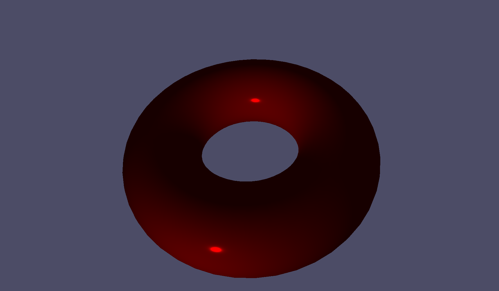
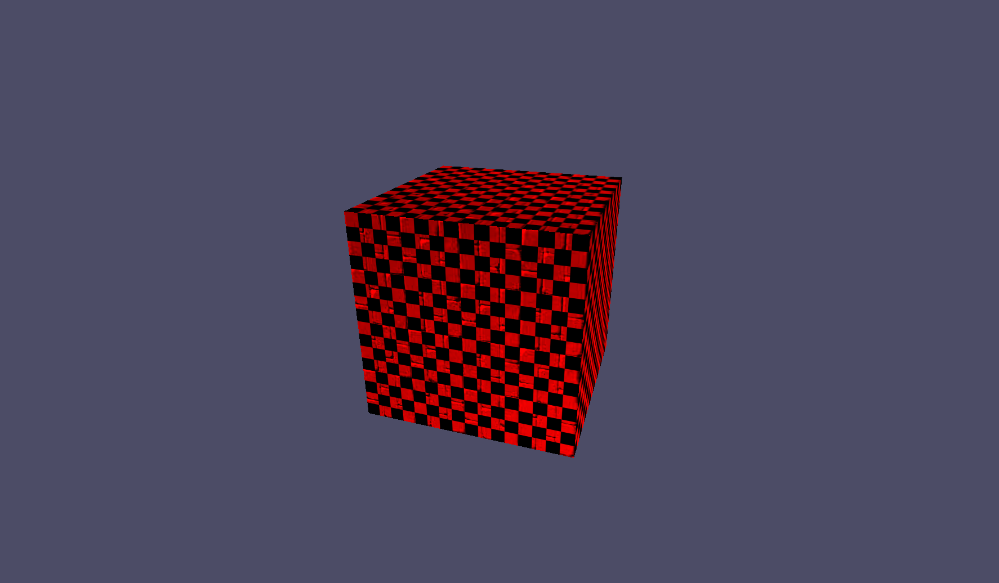
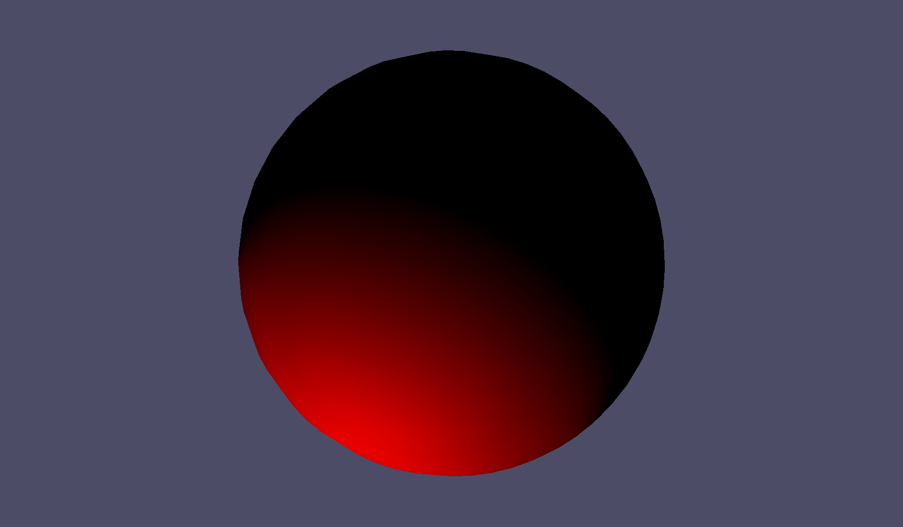
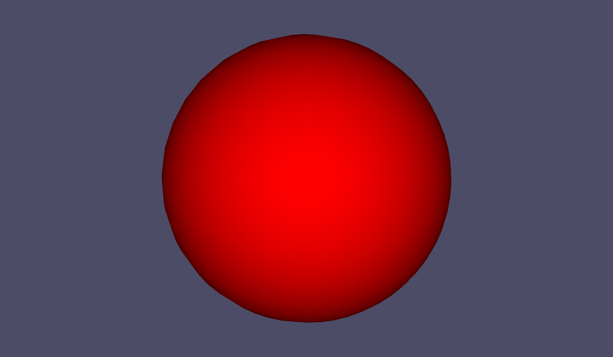
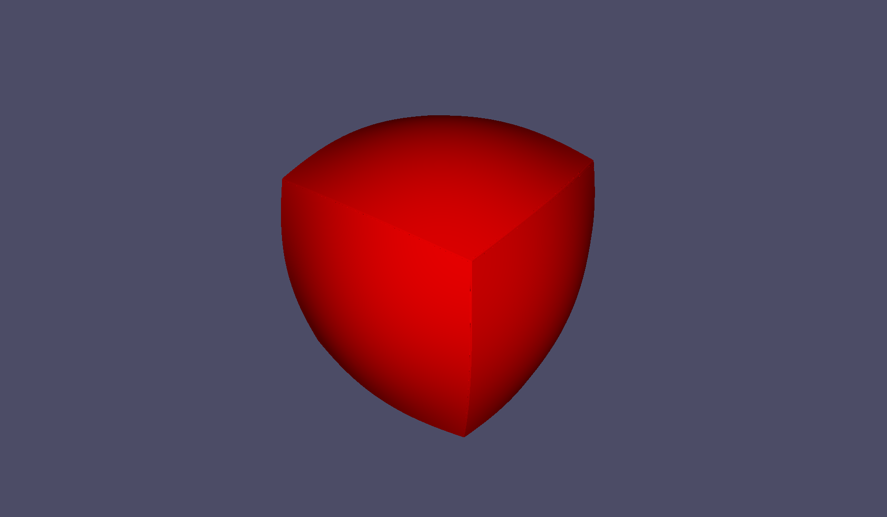
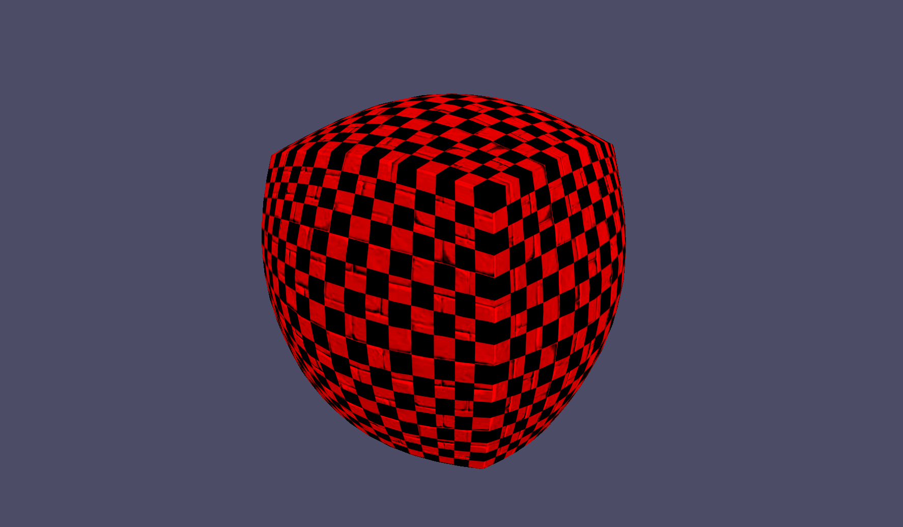

# Assignment #1: Shader Programming

**Course:** CGRA350 Real-time 3D Computer Graphics T2/2024  
**Student Name:** Hamish Burke  

---

## Table of Contents

- [Assignment #1: Shader Programming](#assignment-1-shader-programming)
  - [Table of Contents](#table-of-contents)
  - [Geometry](#geometry)
    - [Core: Sphere using Latitude-Longitude](#core-sphere-using-latitude-longitude)
    - [Completion: Sphere from Cube](#completion-sphere-from-cube)
    - [Challenge: Torus using Latitude-Longitude](#challenge-torus-using-latitude-longitude)
  - [Shader Programming](#shader-programming)
    - [Core: Light Reflection Models](#core-light-reflection-models)
    - [Completion: Texture and Normal Mapping](#completion-texture-and-normal-mapping)
    - [Challenge: Shadow Mapping](#challenge-shadow-mapping)
  - [Results](#results)
  - [Conclusion](#conclusion)

---

## Geometry

### Core: Sphere using Latitude-Longitude

I separated each step into its own function (inside `sphere.hpp` extending `shape.hpp`). I started by generating the points, then the indices, and finally creating and building the actual `cgra::gl_mesh`. I used the same method to create the other objects as well. Each of these methods is called in the object's update function.

### Completion: Sphere from Cube

Implemented fully in `sphere_cube.hpp`, which extends `shape.hpp`. I tried a couple of different ways to handle the normals, so I added a toggle to switch between 'cube' normals and calculated normals (although this added seams to the edges of the object). I changed the normals so that when 'sphereness' is 1, the normal is simply the normalized position (to eliminate the seams).

### Challenge: Torus using Latitude-Longitude

Implemented fully in `torus.hpp`, which extends `shape.hpp`.

## Shader Programming

### Core: Light Reflection Models

I implemented both the Cook-Torrance and Oren-Nayar light reflection models, and added GUI sliders for roughness and F1 for Cook-Torrance, and sigma for Oren-Nayar, as well as ambient and color settings for both (though for some reason, the ucolor doesn't update when changed).

### Completion: Texture and Normal Mapping

I successfully got textures displaying on all three models, as well as the normal mapping working (move the light position around to see it better). I created `comp_frag.glsl` and `comp_vert.glsl`.

### Challenge: Shadow Mapping

I started on an implementation of shadow mapping but didn't finish it. I created the `Application::initializeShadowMapping` function, which generated the buffers, calculated the light space matrix, and loaded the two shaders I made to capture the light pass (`shadow_map_vert.glsl` and `shadow_map_frag.glsl`).

---

## Results

Below are the results of my core, completion, and challenge tasks. Included are images produced by my programs:

## Conclusion

This assignment was particularly challenging, especially the shader programming part. I spent a long time trying to get the two-pass shadow mapping algorithm to work, but to no avail. However, I definitely learned a lot about OpenGL and C++ through this process, especially in terms of passing pointers to objects and generating geometry and normals for meshes.
